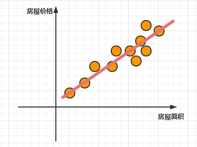
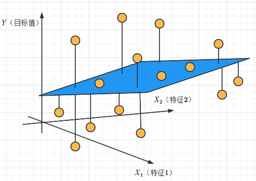

# 线性回归

## 1.例子

### **举个例子**：

给定这样的X、Y值：(1,1)、(2,2)、(3,3)、(4,4)、(10,10)，问当X=5时，Y等于多少？显然Y=5；建立了X与Y的关系：$$Y=X$$

再看一个难一点的例子：给定这样的X、Y值：(1,1)、(2,4)s、(4,16）、(100,10000)，问当X=5时，Y等于多少？显然Y=25，同样建立了X与Y之间的关系：$$Y=X^2$$

### **再举个例子**：

- 期末考试成绩=0.7 * 考试成绩+0.3 * 平时成绩   -----------   建立这样的一个关系：$$Y=0.7*x_1+0.3*x_2$$
  
  （$$x_1$$代表考试成绩、$$x_2$$代表平时成绩、$$Y$$表示期末成绩）
  
- 房子价格=0.02 * 中心区域的距离 + 0.04 * 城市一氧化氮浓度 +0.2 * 城镇犯罪率---------建立关系：$$Y=0.02*x_1+0.04*x_2+0.2*x_3$$（其中Y为房价、$$x_1$$为中心区域距离、$$x_2$$为城市一氧化氮浓度、$$x_3$$为城市犯罪率）
  

**线性回归**就是采用这样的工作原理。计算机会通过"理解"给定的数据，尝试确定X和Y之间”最合适“的关系。使用建立好的关系就可以预测给定的X值并预测未知的Y值（X记为特征值、Y记为目标值，建立特征值与目标值之间的关系---->回归方程）

### **特征与目标之间关系画图分析**

特征值：房屋面积（单特征值）

目标值：房屋价格

特征值：$$X_{1},X{2}$$

目标值：$$Y$$

## 2.符号约定与定义

​	线性回归(Liner regression)是利用回归方程(函数)对一个或者多个自变量（特征值）和因变量（目标值）之间的关系进行建模的一种分析方式。

### (1)符号约定

|             | $$X_{1}$$ | $$X_{2}$$ | $$X_{n}$$ | $$Y$$ |
| ----------- | :-------: | --------- | --------- | ----- |
|             |   面积    | 朝向      | ....      | 价格  |
| $$X^{(1)}$$ |           |           |           |       |
| $$X^{(2)}$$ |           |           |           |       |
| ....        |           |           |           |       |
| $$X^{(n)}$$ |           |           |           |       |

- $$X^{(i)}$$代表一个样本（一行就是一个样本）
- $$X_{i}$$代表一个特征值
- $$Y$$代表目标值

### (2)假设函数

$$
\begin{aligned}
h_{θ}(x)&= θ_{1}x_{1}+θ_{2}x_{2}+θ_{3}x_{3}+...+θ_{n}x_{n}+b\\
&=θ_{1}x_{1}+θ_{2}x_{2}+θ_{3}x_{3}+...+θ_{n}x_{n}+θ_0x_0(其中x_0=1,θ_{0}=b)\\
&=\sum_\limits{i=0}^{n} {θ_ix_i}\\
&=θ^{T}X\\
\end{aligned}
$$

$$
其中θ,X可以理解为矩阵:θ= 
\left\{ 
\begin{matrix} 
θ_{0} \\ 
θ_{1} \\ 
\vdots  \\ 
θ_{n}
\end{matrix} 
\right\} ,
X= 
\left\{ 
\begin{matrix} 
1 \\ 
x_{1} \\ 
\vdots  \\ 
x_{n}
\end{matrix} 
\right\}
$$

### (3)损失函数

**总损失**定义如下：
$$
\begin{aligned}
L_{θ}(x)&= (h_θ(x_1)-y_1)^2+(h_θ(x_2)-y_2)^2+(h_θ(x_3)-y_3)^2+...+(h_θ(x_n)-y_n)^2\\
&=\sum_\limits{i=1}^{n} {(h_θ(x_{i})-y_{i})^2}\\
\end{aligned}
$$

>- $$y_i$$为第i个训练样本的真实值
>- $$h_θ(x_i)$$为第i个训练样本特征值组合预测值
>- 又称为最小二乘法

为了使我们预测的更加准确，如何减小这个损失？我们一直说机器学习有自动学习的功能，在线性回归这里更是能够体现。这里可以通过一些优化方法去优化（其实就是数学当中的求导功能）回归的总损失！

## 3.求解θ

求解θ目的：寻找模型中的θ，使得损失最小（更好拟合）

### (1)正规方程求解θ矩阵推导

一步可以求解θ矩阵使得损失最小

$$Y^{(i)}=h_θ(x^{(i)})+ε^{i}$$

**解释：**

- $$Y^{(i)}代表第i个样本对应的真实值$$
- $$h_θ(x^{(i)})代表第i个样本对应的预测值$$
- $$ε^{i}代表第i个样本对应的误差$$

### (2)梯度下降法

## 4.特征归一化

## 5.欠拟合与过拟合

## 6.Ridage回归

## 7.LASSO回归

## 8.房价预测案例
