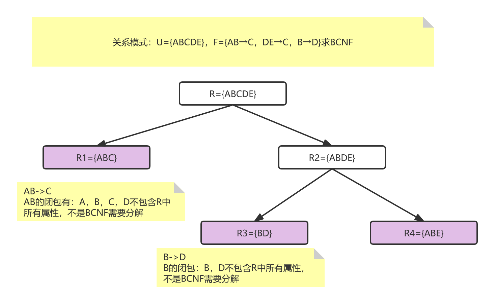
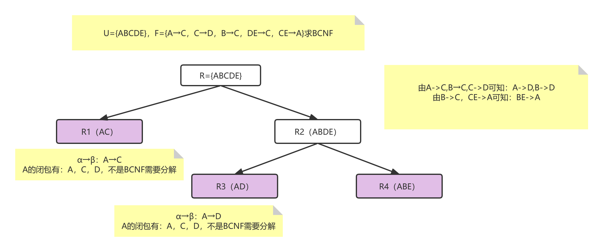
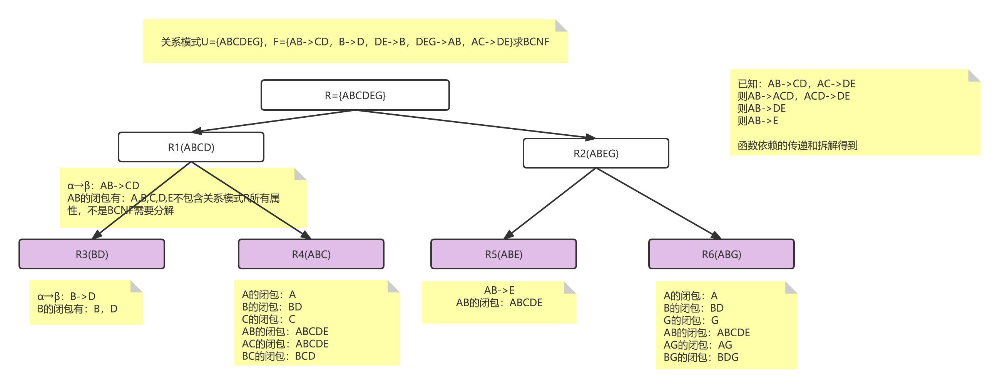

# BCNF记录

## 1.BCNF求解步骤

1. 寻找关系模式中属性α的**闭包**，如果这个属性的闭包**没有包含R中所有属性**，且为**非平凡函数依赖**，则需要拆解，否则直接构建新的关系模式

2. 拆解方法：

   - 非平凡函数依赖α→β，将原来R变为R-β，并构造一个新的关系模式α∪β

   - 依次分解，直到全部拆解完毕。

     > 平凡函数依赖与非平凡函数依赖
     >
     > 例子：在学生选课表中SC（Sno，Cno，Grade）：
     >
     > **非平凡函数依赖**：（Sno，Cno）→Grade
     >
     > 平凡函数依赖：（Sno,Cno）→Sno、（Sno,Cno）→Cno

## 2.例题分析

### 例题1

关系模式U={ABCD}，F={B→C，B→D}，求BCNF

**答**：$$B^+$$​有：B，C，D，并不包含R中所有属性（A），所以不是BCNF。

### 例题2

关系模式：U={ABCD}，F={AB→C，BC→D，CD→A，AD→B}求BCNF

**答：**满足BCNF（验证一下）

$$AB^+$$​​有：A，B，C，D包含R中所有属性

$$BC^+$$​​有：B，C，D，A包含R中所有属性

$$CD^+$$​​有：C，D，A，B包含R中所有属性

$$AD^+$$​​有：A，D，B，C包含R中所有属性

### 例题3

关系模式：U={ABCDE}，F={AB→C，DE→C，B→D}求BCNF

**答：**

$$AB^+$$​​有：A，B，C，D不包含R中所有属性，不是BCNF需要分解

### 例题4

U={ABCDE}，F={A→C，C→D，B→C，DE→C，CE→A}求BCNF

答：

$$A^+$$​​有：A，C，D，不是BCNF需要分解

### 例题5

关系模式U={ABCDEG}，F={AB->CD，B->D，DE->B，DEG->AB，AC->DE}求BCNF

**答：**

$$AB^+$$​​​​有：A,B,C,D,E不包含关系模式R所有属性，不是BCNF需要分解

