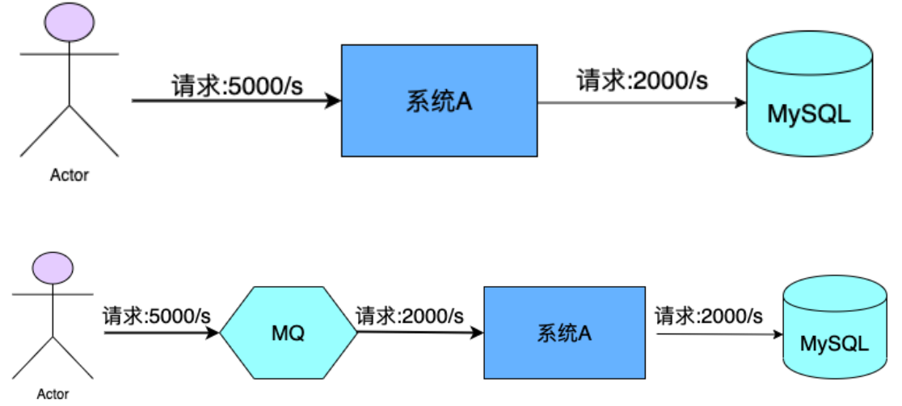
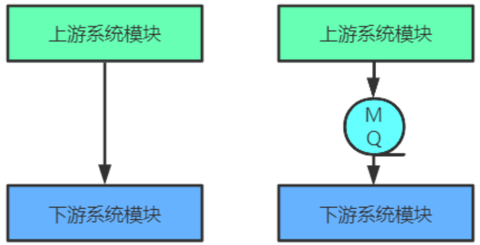

# RocketMQ

# 第1章RocketMQ概述

## 一、MQ概述

### 1、MQ 简介

MQ，Message Queue，是一种提供`消息队列服务`的中间件，也称为消息中间件，是一套提供了消息生产、存储、消费全过程API的软件系统。消息即数据。一般消息的体量不会很大。

### 2、MQ用途

从网上可以查看到很多的关于MQ用途的叙述，但总结起来其实就以下三点。

#### **限流削峰**

MQ可以将系统的超量请求暂存其中，以便系统后期可以慢慢进行处理，从而避免了请求的丢失或系统被压垮。

#### **异步解耦**

上游系统对下游系统的调用若为同步调用，则会大大降低系统的吞吐量与并发度，且系统耦合度太高。而异步调用则会解决这些问题。所以两层之间若要实现由同步到异步的转化，一般性做法就是，在这两层间添加一个MQ层。

#### **数据收集**

分布式系统会产生海量级数据流，如：业务日志、监控数据、用户行为等。针对这些数据流进行实时或批量采集汇总，然后对这些数据流进行大数据分析，这是当前互联网平台的必备技术。通过MQ完成此类数据收集是最好的选择。

### 3、常见MQ产品

#### **ActiveMQ** 

ActiveMQ是使用Java语言开发一款MQ产品。早期很多公司与项目中都在使用。但现在的社区活跃度已经很低。现在的项目中已经很少使用了。

#### **RabbitMQ** 

RabbitMQ是使用ErLang语言开发的一款MQ产品。其吞吐量较Kafka与RocketMQ要低，且由于其不是Java语言开发，所以公司内部对其实现定制化开发难度较大。

#### **Kafka** 

Kafka是使用Scala/Java语言开发的一款MQ产品。其最大的特点就是高吞吐率，常用于大数据领域的实时计算、日志采集等场景。其没有遵循任何常见的MQ协议，而是使用自研协议。对于Spring Cloud Netflix，其仅支持RabbitMQ与Kafka。 

#### **RocketMQ** 

RocketMQ是使用Java语言开发的一款MQ产品。经过数年阿里双11的考验，性能与稳定性非常高。其没有遵循任何常见的MQ协议，而是使用自研协议。对于Spring Cloud Alibaba，其支持RabbitMQ、 Kafka，但提倡使用RocketMQ

#### 对比

|   关键词   | **ACTIVEMQ** | **RABBITMQ** |          **KAFKA**          |        **ROCKETMQ**         |
| :--------: | :----------: | :----------: | :-------------------------: | :-------------------------: |
|  开发语言  |     Java     |    Erlang    |            Java             |            Java             |
| 单机吞吐量 |     万级     |     万级     |           十万级            |           十万级            |
|   Topic    |      -       |      -       | 百级Topic时会影响系统吞吐量 | 千级Topic时会影响系统吞吐量 |
| 社区活跃度 |      低      |      高      |            量高             |            量高             |

### 4、MQ常见协议

一般情况下MQ的实现是要遵循一些常规性协议的。常见的协议如下：

#### **JMS**

JMS，Java Messaging Service（Java消息服务）。是Java平台上有关MOM（Message Oriented Middleware，面向消息的中间件 PO/OO/AO）的技术规范，它便于消息系统中的Java应用程序进行消息交换，并且通过提供标准的产生、发送、接收消息的接口，简化企业应用的开发。ActiveMQ是该协议的典型实现。

#### **STOMP**

STOMP，Streaming Text Orientated Message Protocol（面向流文本的消息协议），是一种MOM设计的简单文本协议。STOMP提供一个可互操作的连接格式，允许客户端与任意STOMP消息代理（Broker）进行交互。ActiveMQ是该协议的典型实现，RabbitMQ通过插件可以支持该协议。 

#### **AMQP**

AMQP，Advanced Message Queuing Protocol（高级消息队列协议），一个提供统一消息服务的应用层标准，是应用层协议的一个开放标准，是一种MOM设计。基于此协议的客户端与消息中间件可传递消息，并不受客户端/中间件不同产品，不同开发语言等条件的限制。 RabbitMQ是该协议的典型实现。

#### **MQTT**

MQTT，Message Queuing Telemetry Transport（消息队列遥测传输），是IBM开发的一个即时通讯协议，是一种二进制协议，主要用于服务器和低功耗IoT（物联网）设备间的通信。该协议支持所有平台，几乎可以把所有联网物品和外部连接起来，被用来当做传感器和致动器的通信协议。 RabbitMQ通过插件可以支持该协议。
