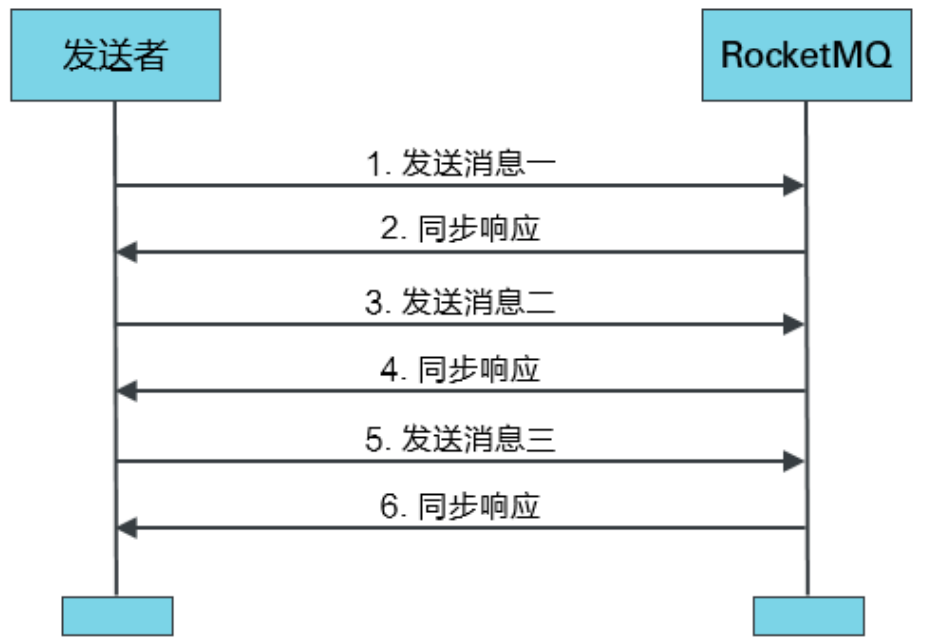
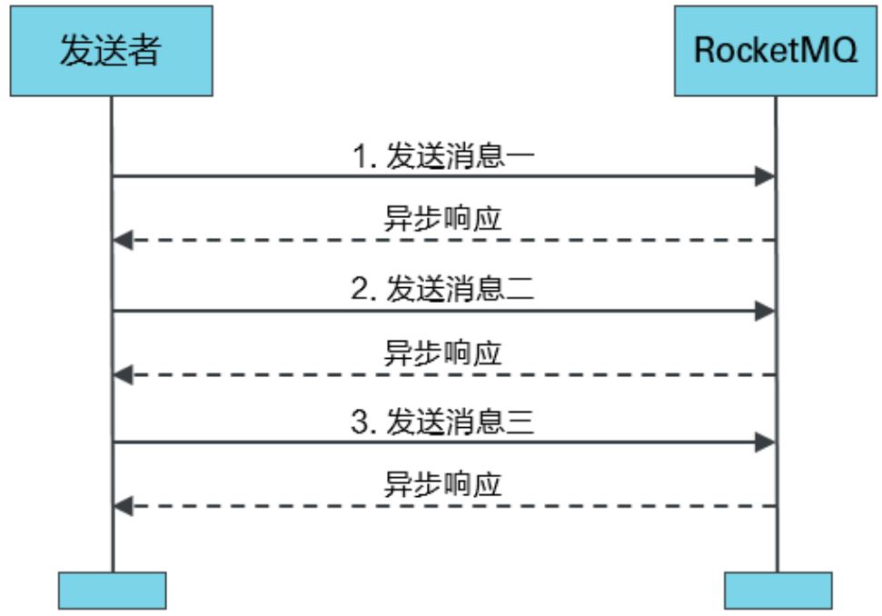
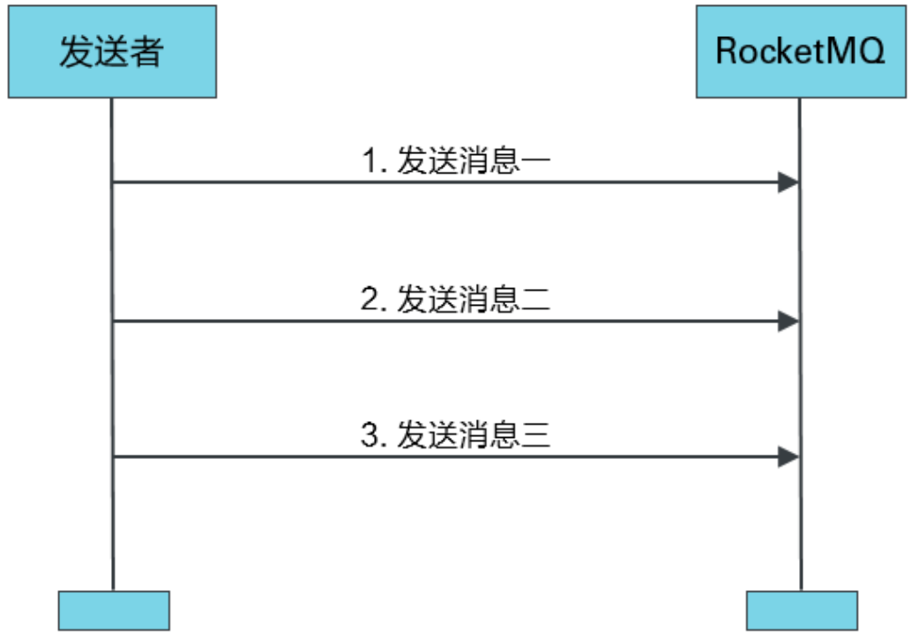
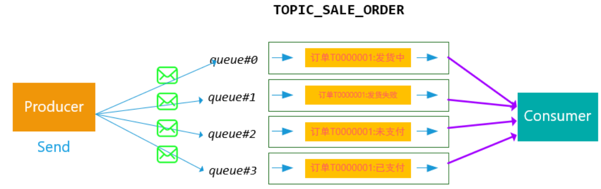
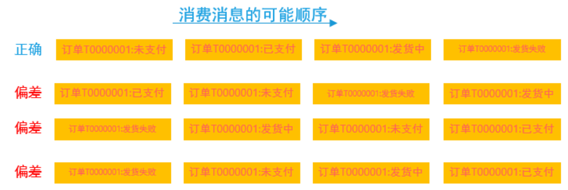
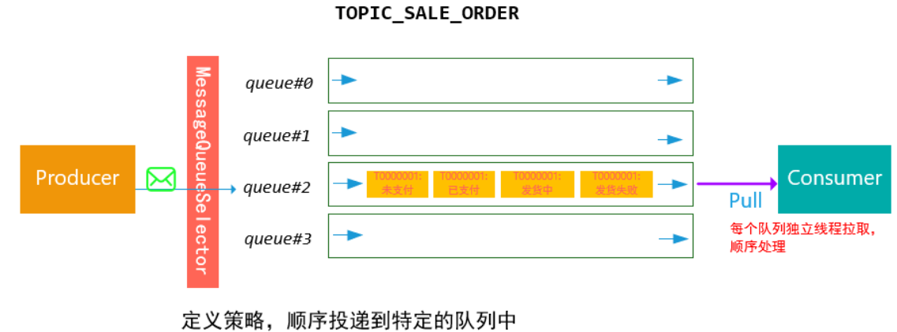
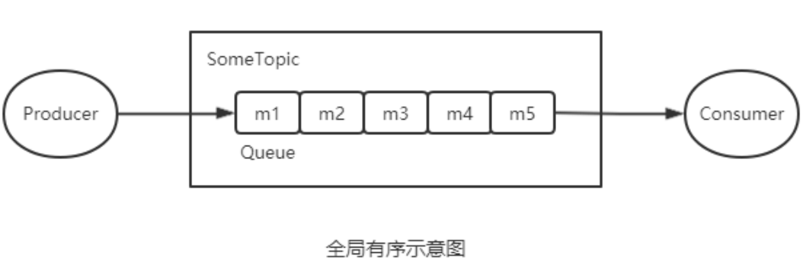
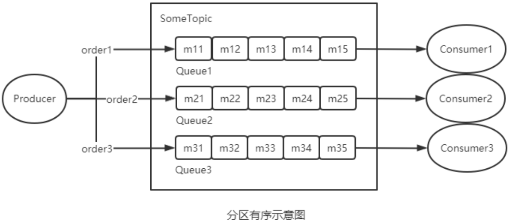

# 04RocketMQ的应用

## 一、普通消息

### 1、消息发送分类

Producer对于消息的发送方式也有多种选择，不同的方式会产生不同的系统效果。

#### 同步发送消息

同步发送消息是指，Producer发出⼀条消息后，会在收到MQ返回的ACK之后才发下⼀条消息。该方式的消息可靠性最高，但消息发送效率太低。



#### 异步发送消息

异步发送消息是指，Producer发出消息后无需等待MQ返回ACK，直接发送下⼀条消息。该方式的消息可靠性可以得到保障，消息发送效率也可以。



#### **单向发送消息**

单向发送消息是指，Producer仅负责发送消息，不等待、不处理MQ的ACK。该发送方式时MQ也不返回ACK。该方式的消息发送效率最高，但消息可靠性较差。



### 2、代码举例

#### 创建工程

创建一个Maven的Java工程rocketmq-test。

#### 导入依赖

导入rocketmq的client依赖。

```xml
<properties> 
    <project.build.sourceEncoding>UTF-8</project.build.sourceEncoding>
    <maven.compiler.source>1.8</maven.compiler.source> 
    <maven.compiler.target>1.8</maven.compiler.target> 
</properties> 
<dependencies> 
    <dependency> 
        <groupId>org.apache.rocketmq</groupId> 
        <artifactId>rocketmq-client</artifactId> 
        <version>4.8.0</version> 
    </dependency> 
</dependencies>
```

#### **定义同步消息发送生产者**

```java
public class SyncProducer { 
    public static void main(String[] args) throws Exception { 
        // 创建一个producer，参数为Producer Group名称 
        DefaultMQProducer producer = new DefaultMQProducer("pg"); 
        // 指定nameServer地址 
        producer.setNamesrvAddr("rocketmqOS:9876"); 
        // 设置当发送失败时重试发送的次数，默认为2次 
        producer.setRetryTimesWhenSendFailed(3); 
        // 设置发送超时时限为5s，默认3s 
        producer.setSendMsgTimeout(5000); 
        // 开启生产者 producer.start(); 
        // 生产并发送100条消息 
        for (int i = 0; i < 100; i++) { 
            byte[] body = ("Hi," + i).getBytes(); 
            Message msg = new Message("someTopic", "someTag", body); 
            // 为消息指定key msg.setKeys("key-" + i); 
            // 发送消息 SendResult sendResult = producer.send(msg); 
            System.out.println(sendResult);
            }
        // 关闭producer 
        producer.shutdown(); 
    } 
}
```

```java
// 消息发送的状态 
public enum SendStatus { 
    SEND_OK, 
    // 发送成功
    FLUSH_DISK_TIMEOUT, 
    // 刷盘超时。当Broker设置的刷盘策略为同步刷盘时才可能出 现这种异常状态。异步刷盘不会出现 
    FLUSH_SLAVE_TIMEOUT, 
    // Slave同步超时。当Broker集群设置的Master-Slave的复 制方式为同步复制时才可能出现这种异常状态。异步复制不会出现 
    SLAVE_NOT_AVAILABLE, 
    // 没有可用的Slave。当Broker集群设置为Master-Slave的 复制方式为同步复制时才可能出现这种异常状态。异步复制不会出现 
}
```

#### **定义异步消息发送生产者**

```java
public class AsyncProducer { 
    public static void main(String[] args) throws Exception { 
        DefaultMQProducer producer = new DefaultMQProducer("pg");
        producer.setNamesrvAddr("rocketmqOS:9876"); 
        // 指定异步发送失败后不进行重试发送 
        producer.setRetryTimesWhenSendAsyncFailed(0); 
        // 指定新创建的Topic的Queue数量为2，默认为4 
        producer.setDefaultTopicQueueNums(2); 
        producer.start(); 
        for (int i = 0; i < 100; i++) { 
            byte[] body = ("Hi," + i).getBytes(); 
            try {
                Message msg = new Message("myTopicA", "myTag", body); 
                // 异步发送。指定回调 
                producer.send(msg, new SendCallback() { 
                    // 当producer接收到MQ发送来的ACK后就会触发该回调方法的执行 
                    @Override public void onSuccess(SendResult sendResult) { 
                        System.out.println(sendResult); 
                    }
                    @Override public void onException(Throwable e) { 
                        e.printStackTrace(); 
                    }
                });
            } catch (Exception e) { 
                e.printStackTrace();
            }
        } 
        // end-for 
        // sleep一会儿 
        // 由于采用的是异步发送，所以若这里不sleep，
        // 则消息还未发送就会将producer给关闭，报错 
        TimeUnit.SECONDS.sleep(3); 
        producer.shutdown(); 
    } 
}
```

#### **定义单向消息发送生产者**

```java
public class OnewayProducer { 
    public static void main(String[] args) throws Exception{ 
        DefaultMQProducer producer = new DefaultMQProducer("pg"); 
        producer.setNamesrvAddr("rocketmqOS:9876"); 
        producer.start(); 
        for (int i = 0; i < 10; i++) { 
            byte[] body = ("Hi," + i).getBytes(); 
            Message msg = new Message("single", "someTag", body); 
            // 单向发送
            producer.sendOneway(msg); 
        }
        producer.shutdown(); 
        System.out.println("producer shutdown"); 
    } 
}
```

#### **定义消息消费者**

```java
public class SomeConsumer { 
    public static void main(String[] args) throws MQClientException { 
        // 定义一个pull消费者 
        // DefaultLitePullConsumer consumer = new DefaultLitePullConsumer("cg"); 
        // 定义一个push消费者 
        DefaultMQPushConsumer consumer = new DefaultMQPushConsumer("cg"); 
        // 指定nameServer 
        consumer.setNamesrvAddr("rocketmqOS:9876"); 
        // 指定从第一条消息开始消费
        consumer.setConsumeFromWhere(ConsumeFromWhere.CONSUME_FROM_FIRST_OFFSET ); 
        // 指定消费topic与tag 
        consumer.subscribe("someTopic", "*"); 
        // 指定采用“广播模式”进行消费，默认为“集群模式” 
        // consumer.setMessageModel(MessageModel.BROADCASTING); 
        // 注册消息监听器 
        consumer.registerMessageListener(new MessageListenerConcurrently() { 
            // 一旦broker中有了其订阅的消息就会触发该方法的执行， 
            // 其返回值为当前consumer消费的状态 
            @Override public ConsumeConcurrentlyStatus consumeMessage(List<MessageExt> msgs, ConsumeConcurrentlyContext context) { 
                // 逐条消费消息 
                for (MessageExt msg : msgs) { 
                    System.out.println(msg); 
                }
                // 返回消费状态：消费成功 
                return ConsumeConcurrentlyStatus.CONSUME_SUCCESS; 
            } 
        }); 
        // 开启消费者消费 
        consumer.start(); 
        System.out.println("Consumer Started"); 
    } 
}
```

## 二、顺序消息

### 1、什么是顺序消息

​		顺序消息指的是，严格按照消息的**发送顺序**进行消费的消息(FIFO)。

​		默认情况下生产者会把消息以Round Robin轮询方式发送到不同的Queue分区队列；而消费消息时会从多个Queue上拉取消息，这种情况下的发送和消费是不能保证顺序的。如果将消息仅发送到同一个Queue中，消费时也只从这个Queue上拉取消息，就严格保证了消息的顺序性。

### 2、为什么需要顺序消息

例如，现在有**TOPIC ORDER_STATUS** (订单状态)，其下有4个Queue队列，该Topic中的不同消息用于描述当前订单的不同状态。假设订单有状态：未支付、已支付、发货中、发货成功、发货失败。

根据以上订单状态，生产者从**时序**上可以生成如下几个消息：订单T0000001:未支付 --> 订单T0000001:已支付 --> 订单T0000001:发货中 --> 订单T0000001:发货失败

消息发送到MQ中之后，Queue的选择如果采用轮询策略，消息在MQ的存储可能如下：





这种情况下，我们希望Consumer消费消息的顺序和我们发送是一致的，然而上述MQ的投递和消费方式，我们无法保证顺序是正确的。对于顺序异常的消息，Consumer即使设置有一定的状态容错，也不能完全处理好这么多种随机出现组合情况。



基于上述的情况，可以设计如下方案：对于相同订单号的消息，通过一定的策略，将其放置在一个Queue中，然后消费者再采用一定的策略（例如，一个线程独立处理一个queue，保证处理消息的顺序性），能够保证消费的顺序性。

### 3、有序性的分类

根据有序范围的不同，RocketMQ可以严格地保证两种消息的有序性：分区有序与全局有序。

#### 全局有序



当发送和消费参与的Queue只有一个时所保证的有序是整个Topic中消息的顺序， 称为全局有序。 

> 在创建*Topic*时指定*Queue*的数量。有三种指定方式： 
>
> *1*）在代码中创建*Producer*时，可以指定其自动创建的*Topic*的*Queue*数量 
>
> *2*）在*RocketMQ*可视化控制台中手动创建*Topic*时指定*Queue*数量 
>
> *3*）使用*mqadmin*命令手动创建*Topic*时指定*Queue*数量

#### 分区有序



如果有多个Queue参与，其仅可保证在该Queue分区队列上的消息顺序，则称为分区有序。 

> 如何实现*Queue*的选择？在定义*Producer*时我们可以指定消息队列选择器，而这个选择器是我们自己实现了*MessageQueueSelector*接口定义的。 
>
> 在定义选择器的选择算法时，一般需要使用选择*key*。这个选择*key*可以是消息*key*也可以是其它数据。但无论谁做选择*key*，都不能重复，都是唯一的。
>
> 一般性的选择算法是，让选择*key*（或其*hash*值）与该*Topic*所包含的*Queue*的数量取模，其结果即为选择出的*Queue*的*QueueId*。
>
>  
>
> 取模算法存在一个问题：不同选择*key*与*Queue*数量取模结果可能会是相同的，即不同选择*key*的消息可能会出现在相同的*Queue*，即同一个*Consuemr*可能会消费到不同选择*key*的消息。这个问题如何解决？一般性的作法是，从消息中获取到选择*key*，对其进行判断。若是当前*Consumer*需要消费的消息，则直接消费，否则什么也不做。这种做法要求选择*key*要能够随着消息一起被*Consumer*获取到。此时使用消息*key*作为选择*key*是比较好的做法。
>
> 以上做法会不会出现如下新的问题呢？不属于那个*Consumer*的消息被拉取走了，那么应该消费该消息的*Consumer*是否还能再消费该消息呢？同一个*Queue*中的消息不可能被同一个*Group*中的不同*Consumer*同时消费。所以，消费现一个*Queue*的不同选择*key*的消息的*Consumer*一定属于不同的*Group*。而不同的*Group*中的*Consumer*间的消费是相互隔离的，互不影响的。

### 4、代码举例

```java
public class OrderedProducer { 
    public static void main(String[] args) throws Exception { 
        DefaultMQProducer producer = new DefaultMQProducer("pg"); 
        producer.setNamesrvAddr("rocketmqOS:9876"); 
        producer.start(); 
        for (int i = 0; i < 100; i++) { 
            Integer orderId = i; 
            byte[] body = ("Hi," + i).getBytes(); 
            Message msg = new Message("TopicA", "TagA", body); 
            SendResult sendResult = producer.send(msg, new MessageQueueSelector() { 
                @Override public MessageQueue select(List<MessageQueue> mqs, Message msg, Object arg) {
                    Integer id = (Integer) arg; 
                    int index = id % mqs.size(); 
                    return mqs.get(index); 
                } 
            }, orderId); 
            System.out.println(sendResult); 
        }
        producer.shutdown(); 
    }
}
```

## 三、延时消息

