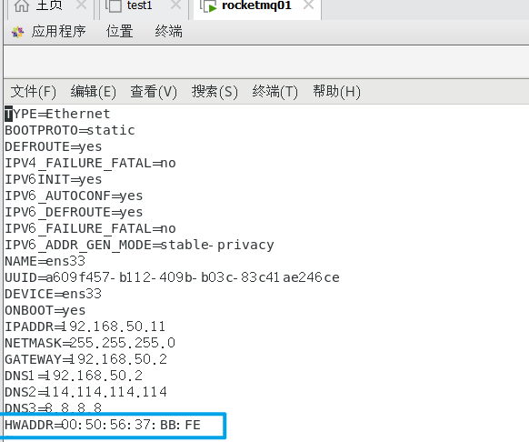
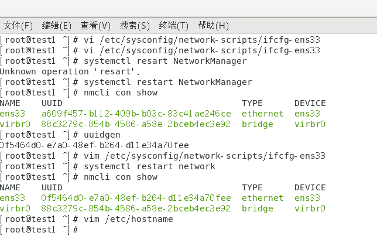

# 常用命令

# 1.防火墙

```shell
#防火墙---centos7
systemctl status firewalld.service
systemctl stop firewalld.service
#永久关闭
systemctl disable firewalld.service 

```

# 2、vmware复制

```
#1.mac地址重新生成
00:50:56:26:8F:04
#2.在将生成的MAC地址写入/etc/sysconfig/network-scripts/ifcfg-ens33文件
#修改UUID，UUID克隆虚拟机后一般是一样的，需要进行修改
```





